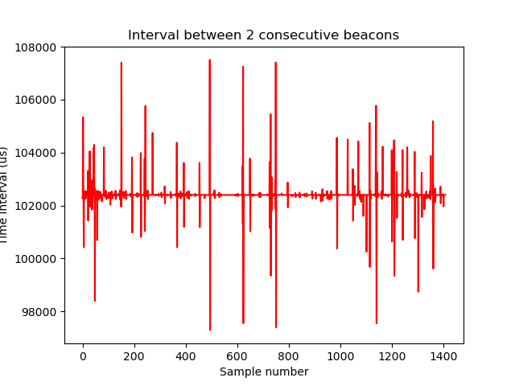
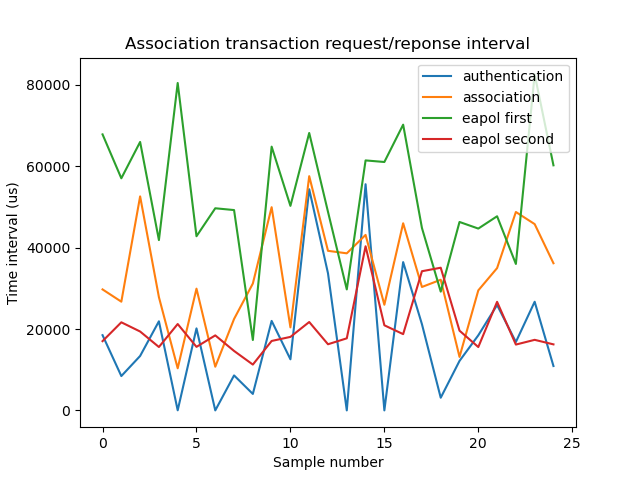

# Packet Capture

## Setup interface

```console
sudo ifconfig wlx00c0ca53a4b4 down
sudo iwconfig wlx00c0ca53a4b4 mode monitor
sudo ifconfig wlx00c0ca53a4b4 up
sudo iwconfig wlx00c0ca53a4b4 channel 6

sudo iw dev
```
## Wireshark filters

### Frame type

- wlan.fc.type_subtype == 0	    | association request
- wlan.fc.type_subtype == 1	    | association response
- wlan.fc.type_subtype == 2	    | re-association request
- wlan.fc.type_subtype == 3	    | re-association response
- wlan.fc.type_subtype == 4	    | probe requests
- wlan.fc.type_subtype == 5	    | probe responses
- wlan.fc.type_subtype == 8	    | beacons
- wlan.fc.type_subtype == 10	| disassosiations
- wlan.fc.type_subtype == 11	| authentications
- wlan.fc.type_subtype == 12	| deauthentications

### Authentication eapol
- eapol.keydes.type == 2		| authentication eapol 

### Access point comunications filter
- wlan.ta == <access_point_mac>    | transmission address
- wlan.ra == <access_point_mac>   | receiver address


### Examples

- (association request || association response || authentications || authentication eapol) && (AP address (transmission) || AP address (receiver) )

```console
(wlan.fc.type_subtype == 0 || wlan.fc.type_subtype == 1 || wlan.fc.type_subtype == 11 || eapol.keydes.type == 2) && (wlan.ta == 84:0b:7c:b6:87:26 || wlan.ra == 84:0b:7c:b6:87:26)
```

- (beacons) && (AP address (transmission))

```console
(wlan.fc.type_subtype == 8) && (wlan.ta == 84:0b:7c:b6:87:26)
```

# Python code

## Virtual environment

```console
python3 -m venv .venv
source .venv/bin/activate
pip install -r requirements.txt
```

## Beacon frame

### Data sampling
#### Usage

python sampleBeaconFrame.py -i <input_file> -a <access_point_mac>

Example:

Linux
```console
python3 sampleBeaconFrame.py -i packets/homeBeacon2.pcapng -a 84:0b:7c:b6:87:26
```

Windows
```console
py sampleBeaconFrame.py -i packets\homeBeacon2.pcapng -a 84:0b:7c:b6:87:26
```
### Plot data

#### Usage

Use the output file from the previous step as the input file.

python3 plotBeaconFrame.py -i <input_file> [-o <output_file>]

Example:

Linux
```console
python3 plotBeaconFrame.py -i packets/homeBeacon2.csv
```

Windows
```console
py plotBeaconFrame.py -i packets\homeBeacon2.csv
```


## Association transaction
### Data sampling
#### Usage

python3 sampleAssociation.py -i <input_file> -a <access_point_mac> [-v]

Example:

Linux
```console
python3 sampleAssociation.py -i packets/homeAssociation.pcapng -a 84:0b:7c:b6:87:26 -v 
```

Windows
```console
py sampleAssociation.py -i packets\homeAssociation.pcapng -a 84:0b:7c:b6:87:26 -v 
```
### Plot data

#### Usage

Use the output file from the previous step as the input file.

python3 plotAssociation.py -i <input_file> [-o <output_file>]

Example:

Linux
```console
python3 plotAssociation.py -i packets/homeAssociation.csv
```

Windows
```console
py plotAssociation.py -i packets/homeAssociation.csv
```




## Observation windows

Use the output csv file from the previous steps as the input file.


#### SEQUENTIAL Observation Windows

Linux
```console
python3 baseObsWindows.py -i packets/homeBeacon2.csv -m 1 -w 100
python3 baseObsWindows.py -i packets/homeAssociation.csv -m 1 -w 5
```

Windows
```console
py baseObsWindows.py -i packets\homeBeacon2.csv -m 1 -w 100
py baseObsWindows.py -i packets\homeAssociation.csv -m 1 -w 5
```

#### SLIDING Observation Windows

Linux
```console
python3 baseObsWindows.py -i packets/homeBeacon2.csv -m 2 -s 5 -w 100
python3 baseObsWindows.py -i packets/homeAssociation.csv -m 2 -s 2 -w 5
```

Windows
```console
py baseObsWindows.py -i packets\homeBeacon2.csv -m 2 -s 5 -w 100
py baseObsWindows.py -i packets\homeAssociation.csv -m 2 -s 2 -w 5
```
#### MULTIPLE SLIDING Observation Windows

Linux
```console
python3 baseObsWindows.py -i packets/homeBeacon2.csv -m 3 -s 5 -w 100 200
python3 baseObsWindows.py -i packets/homeAssociation.csv -m 3 -s 2 -w 5 10
```

Windows:
```console
py baseObsWindows.py -i packets\homeBeacon2.csv -m 3 -s 5 -w 50 100
py baseObsWindows.py -i packets\homeAssociation.csv -m 3 -s 2 -w 5 10
```
## Extract feature

Use the generated sliding windows outputs.

Linux:
```
python3 baseExtractFeatures.py -i windows/homeBeacon2_obs_m1 -w 100
python3 baseExtractFeatures.py -i windows/homeAssociation_obs_s2_m3 -w 5 10
```

Windows:
```
py baseExtractFeatures.py -i windows\homeBeacon2_obs_m1 -w 100
py baseExtractFeatures.py -i windows\homeAssociation_obs_s2_m3 -w 5 10
```

## MAC list

home - 84:0b:7c:b6:87:26 

other_home - 00:37:b7:4f:c6:fa

other2_home - 1c:20:db:d0:d7:d8